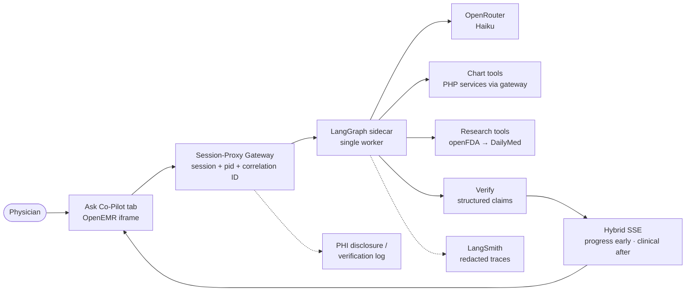
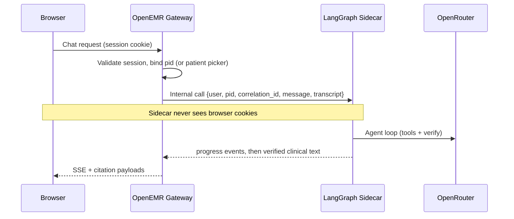
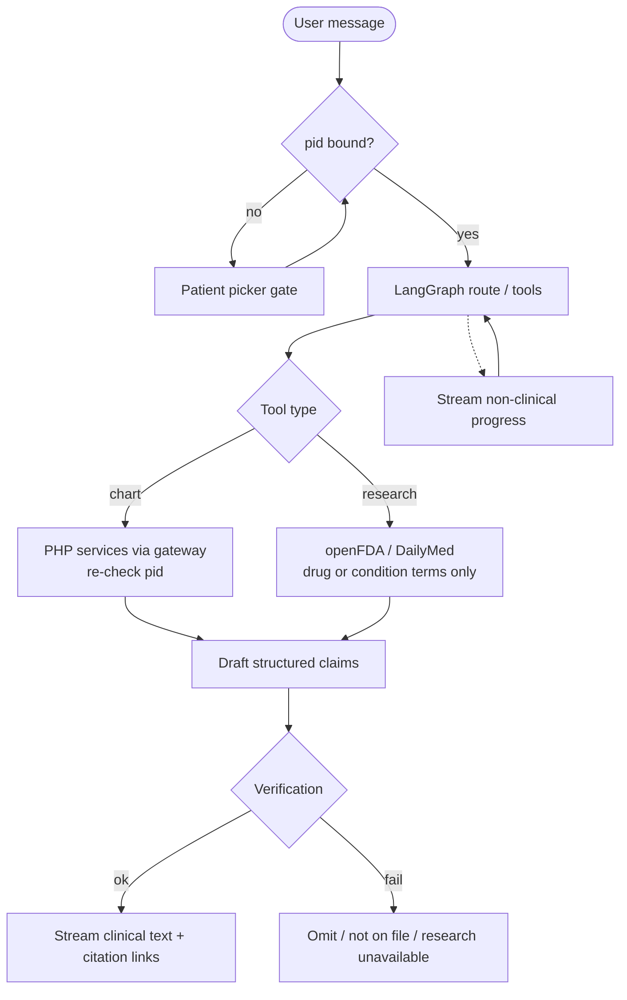
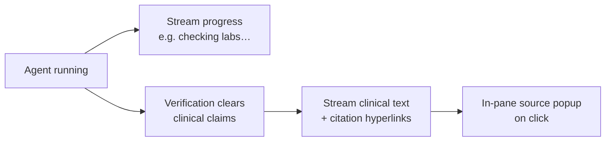

# Clinical Co-Pilot — Architecture Overview

**Status:** Technical decisions locked · canonical plan in [`ARCHITECTURE.md`](../ARCHITECTURE.md).

## Summary (~95 words)

Hybrid agent: physician uses an **Ask Co-Pilot** tab in OpenEMR. A **session-proxy gateway** validates the OpenEMR session, binds patient `pid` (patient picker if unbound), and calls a **LangGraph** sidecar — the browser never sends cookies to the sidecar. Chart reads are **PHP services via gateway** (pid-scoped, fail closed). Research uses **openFDA** (DailyMed fallback); drug/condition terms only; dosing only from retrieved sources; conflicts surfaced. **Hybrid SSE:** progress immediately; clinical text only after structured verify. **OpenRouter (Haiku)**; **LangSmith** redacted + disclosure log. Same 2 GB host, one worker; open-tab transcript until closed. Chart read-only; SMART/FHIR primary later.

---

## System topology

## Request path (auth)

## Agent loop (UC-1 / UC-2 / UC-3)

## Hybrid streaming policy

## Locked decision snapshot

| Topic | Choice |
| --- | --- |
| Auth | Session-proxy; SMART later |
| Chart | Services-first via gateway |
| Research | openFDA → DailyMed; fail closed on dosing |
| Verify | Structured claims; cite-or-silence |
| Stream | Hybrid SSE |
| State | Open-tab transcript until closed |
| Deploy | Same 2 GB host; one worker |
| Model | Haiku everywhere (MVP) |
| No pid | Patient picker before chart tools |
