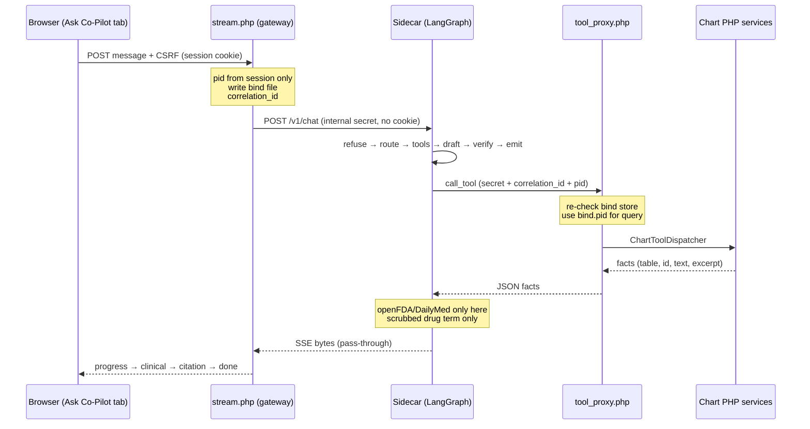
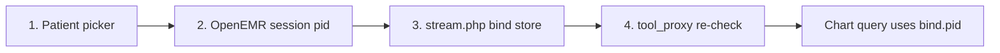
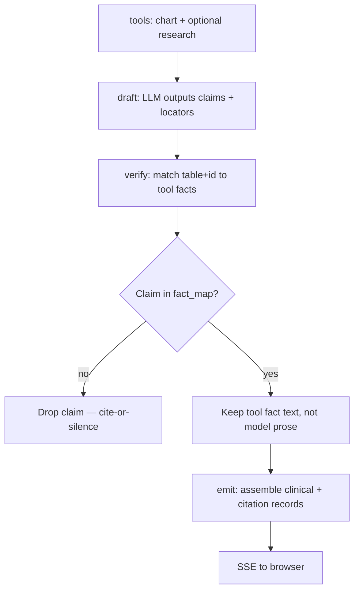
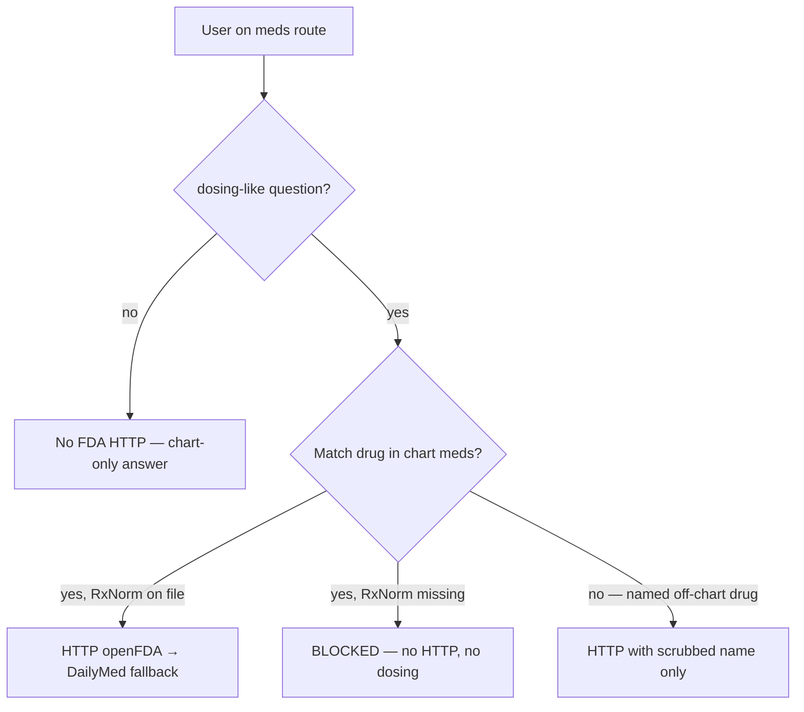

# Clinical Co-Pilot — Concepts Guide

Junior-friendly map of five core topics: request path, `pid` binding, verify + SSE, UC-3 RxNorm fork, and partial failure. Grounded in how this repo actually works.

---

## Mental model first

Think of Co-Pilot as **three rooms** connected by **locked doors**:

| Room | Who lives there | What it knows |
|------|-----------------|---------------|
| **Browser** | Physician UI | OpenEMR session cookie, `pid` in session after picker |
| **OpenEMR gateway** (`stream.php`, `tool_proxy.php`) | PHP trust layer | Session + bind store + chart DB |
| **Sidecar** (LangGraph + OpenRouter) | AI brain | Message, `pid`, correlation id, tool facts — **no browser cookie** |

The gateway is the bouncer. The sidecar is the analyst. Chart data never goes to FDA.

---

## 1. Request path: browser → stream.php → sidecar → tool_proxy → chart services

### One sentence

The browser talks only to OpenEMR; OpenEMR talks to the sidecar; the sidecar asks OpenEMR again (via secret) for chart rows; research stays inside the sidecar.

### Flow (happy path)



### What **never** crosses each boundary

| Boundary | Crosses | Never crosses |
|----------|---------|---------------|
| **Browser → sidecar** | Nothing direct | Session cookie, CSRF, raw OpenEMR auth |
| **stream.php → sidecar** | `correlation_id`, `user_id`, `username`, `pid`, `message`, sanitized transcript | Browser cookies; client-chosen `pid` (ignored) |
| **Sidecar → tool_proxy** | Internal secret, `correlation_id`, tool name, `pid`/`user_id` (checked against bind) | Session cookie; unbound or mismatched pid |
| **Sidecar → openFDA/DailyMed** | Scrubbed drug name and/or RxCUI digits | Patient name, DOB, MRN, full user message, any PHI |
| **Sidecar → browser (clinical text)** | Only **verified** assembled text + citations | Raw LLM draft before verify; unlinked model guesses |

**Easy memory:** *Cookie stops at PHP. PHI stops before FDA. Clinical text stops at verify.*

### Code anchors

**Session `pid` only — client `pid` ignored** (`interface/ask_copilot/stream.php`):

```php
$sessionPid = $session->get('pid');
// Client-supplied pid is intentionally ignored for binding (fail-closed).
$ignoredClientPid = filter_input(INPUT_POST, 'pid', FILTER_UNSAFE_RAW, FILTER_REQUIRE_SCALAR);
```

**Chart reads use bind-checked pid** (`src/ClinicalCopilot/Gateway/ToolProxyService.php`):

```php
// Always use bind-checked pid — never trust args.pid for chart reads.
$factSet = $this->chartDispatcher->dispatch($tool, $bind->pid);
```

Research is **sidecar-only** — it never goes through `tool_proxy.php` (`sidecar/app/research/`).

---

## 2. Where `pid` is bound and re-checked

### One sentence

**You pick the patient in OpenEMR UI → session gets `pid` → gateway copies that into a bind file → every chart read re-proves the same patient.**

### The four checkpoints



| Step | What happens | Fail-closed? |
|------|----------------|--------------|
| **1. Picker** | Physician must choose patient; chat blocked until bound | No auto-select |
| **2. Session** | `demographics.php?set_pid=` sets session `pid` | Unbound → SSE `unbound_patient` |
| **3. stream.php** | Reads session `pid` only; writes `correlation_id → (pid, user_id)` file | Client `pid` / LLM pid **discarded** |
| **4. tool_proxy** | Loads bind by `correlation_id`; rejects `pid_mismatch`, `user_mismatch`, `bind_missing` | Uses **`$bind->pid`**, not attacker-supplied pid |

### Analogy

Session `pid` is your wristband at clinic check-in. The bind file is the stamp for *this one question*. Every chart tool asks: “Does this stamp match this wristband and this staff ID?”

### What gets ignored on purpose

- POST field `pid` from JavaScript
- Anything the LLM might “infer” about patient identity
- `bound_pid` is only a **consistency check** (must match session if sent), not a source of truth

**SessionGateway** (`src/ClinicalCopilot/Gateway/SessionGateway.php`):

```php
// Explicitly discard any client-supplied pid — bind from session only.
unset($requestPidIgnored);
```

### Why

OpenEMR ACL is role-based, not per-patient. Co-Pilot adds its own patient scope so the model cannot pivot to another chart.

---

## 3. Verify + SSE order

### One sentence

**Tools fetch facts → LLM proposes claim+locator pairs → verify keeps only claims that match real tool rows → then the UI streams progress, then safe clinical text, then citations.**

### Inside the sidecar (before anything clinical hits the browser)



### Verify rule (the important part)

For each draft claim, look up `(table, id)` in the tool fact map. If missing → **silent drop**. If present → user sees **database/research text**, not the model’s wording.

From `sidecar/app/claims.py` — `verify_claims()`:

- **Cite-or-silence:** never ship model-authored clinical text for a known locator.
- Surviving claims keep their original `source_type` (`chart`, `note`, or `research`).

After verify, `emit` builds `clinical_text`, `clinical_segments`, and `citations`.

### LangGraph node order

`refuse → route → tools → draft → verify → emit` (`sidecar/app/graph.py`).

### What the **browser** sees (SSE order)

| Order | Event | Meaning |
|-------|--------|---------|
| 1 | `progress` (0..n) | “Pulling labs…”, “Looking up label information…” — **no clinical claims** |
| 2 | `clinical` | `{ text, segments[] }` — only verified + assembly/refusal lines |
| 3 | `citation` | `{ citations: [...] }` — always sent, even `[]` |
| 4 | `done` | Turn complete |

Progress can start **during** the graph (while tools run). **Clinical** waits until verify+emit finish. The client **buffers** clinical + citation before painting (so Source links work).

From `sidecar/app/stream.py`:

```python
yield ("clinical", {"text": clinical_text, "segments": segments})
yield ("citation", {"citations": citations})
yield ("done", {"correlation_id": correlation_id})
```

**Easy memory:** *Draft is a proposal. Verify is the editor. SSE clinical is the published article.*

---

## 4. UC-3 fork: RxNorm present vs empty

UC-3 = medication decision support (chart + external labels). The **research fork** is narrow.

### Decision tree



### Cases (local demo)

| Case | Example (local demo) | HTTP? | Dosing in answer? |
|------|----------------------|-------|-------------------|
| Coded RxNorm | pid 6 simvastatin | Yes | Yes, if label retrieved + verified |
| Uncertain RxNorm | pid 2 Lisinopril (empty code) | **No** | **No** — assembly says “RxNorm not on file — drug identity uncertain” + dosing refusal |
| Not dosing-like | “What meds is patient on?” | No | N/A (list from chart) |
| Off-chart named drug | “Dose of amoxicillin?” | Yes (if resolves to one SPL) | Yes + **must** say not on active list |

### Gates (all required for FDA HTTP)

1. Route must be **`meds`** (never brief/labs).
2. Question must be **`is_dosing_like`** (“typical dose”, “how many mg”, etc.).
3. Drug resolve must return **`ResolveStatus.OK`** — not `BLOCKED` or `NONE`.

**Uncertain RxNorm** → `BLOCKED` in `sidecar/app/research/resolve.py` → no HTTP in `sidecar/app/nodes/tools.py`:

```python
if resolved.status is not ResolveStatus.OK or resolved.query is None:
    # BLOCKED / NONE → no HTTP, no research progress (verify may refuse).
    return
```

**Easy memory:** *No RxNorm on chart row → we don’t know which drug → we don’t call FDA → we don’t dose.*

Outbound research uses scrubbed `DrugQuery` only — never raw user message or PHI (PRD 05).

---

## 5. Partial failure: some tools OK, explicit “unavailable” lines

### One sentence

**One broken chart tool doesn’t kill the whole turn — you get verified facts from what worked plus honest one-liners for what didn’t.**

### Two different failure modes

| Mode | Example | Whole turn? |
|------|---------|-------------|
| **Partial domain failure** | Brief: labs OK, notes 5xx | **Continues** — “Notes unavailable — try again.” |
| **Fail-closed auth/bind** | `pid_mismatch`, bad secret | **Stops** — SSE `error`, no clinical |

During brief, four tools run in parallel (`patient_context`, `labs`, `meds`, `notes`). Failures go into `tool_domain_errors`; successes still feed verify.

### Allowlisted unavailable lines

From `sidecar/app/claims.py`:

| Tool | Line |
|------|------|
| `patient_context` | Chart summary unavailable — try again. |
| `labs` | Labs unavailable — try again. |
| `meds` | Medications unavailable — try again. |
| `notes` | Notes unavailable — try again. |

### Empty ≠ error

- `facts: []` = success, nothing on file → e.g. “No recent labs on file.”
- Tool 5xx / gateway error = **unavailable** line for that domain only.

### Research miss is also partial

Chart facts can still verify; dosing gets `no_research` refusal — **not** an SSE `error` event. Turn succeeds with cited chart + explicit refusal of unsupported dosing.

**Easy memory:** *Unavailable = system broke. Empty = chart has nothing. Both are honest; neither invents data.*

---

## Cheat sheet (interview-sized)

| Topic | Remember as |
|-------|-------------|
| Path | Browser → PHP gateway → sidecar → PHP tool_proxy → chart services; research stays in sidecar |
| Boundaries | No cookie to sidecar; no PHI to FDA; no unverified clinical to browser |
| pid | Picker → session → bind file → tool_proxy; client/LLM pid ignored |
| Verify + SSE | tools → draft → verify (drop bad) → emit → progress* → clinical → citation → done |
| UC-3 RxNorm | Present → FDA path; missing → blocked, no dose |
| Partial failure | Mixed OK + “… unavailable — try again.”; auth errors still fail-closed |

---

## See it yourself (local)

After stack up + `scripts/copilot/setup-local-demo.sh`:

1. **Unbound** — open Ask Co-Pilot → picker blocks send (`unbound_patient` if you bypass).
2. **pid 6** — “typical adult dose of simvastatin” → progress includes label lookup → cited dosing.
3. **pid 2** — same question on Lisinopril → no “Looking up label…” → uncertain line + no dosing.
4. **Brief** — ask for summary; if one tool fails, others still appear with unavailable line.

Pass/fail checklist: [`docs/local-demo-success-criteria.md`](local-demo-success-criteria.md).

---

## Related docs

| Doc | Topic |
|-----|--------|
| [`ARCHITECTURE.md`](../ARCHITECTURE.md) | Canonical locks |
| [`docs/architecture-tech-primer.md`](architecture-tech-primer.md) | Broader stack study guide |
| [`docs/PRDs/05-research-tools.md`](PRDs/05-research-tools.md) | UC-3 research invariants |
| [`docs/PRDs/06-citations-hybrid-sse.md`](PRDs/06-citations-hybrid-sse.md) | Citations + SSE contract |
| [`memory-bank/systemPatterns.md`](../memory-bank/systemPatterns.md) | Patterns summary for agents |
